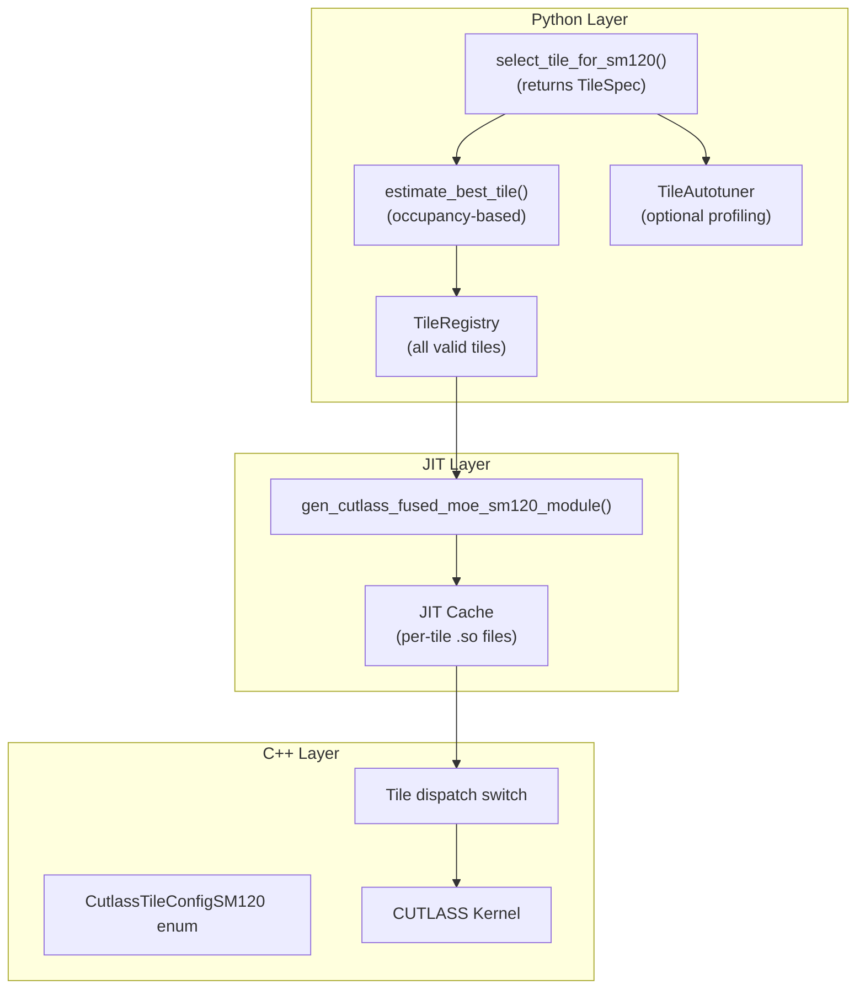

# Small Tile Support Overhaul for FlashInfer SM120

## Architecture Overview

The solution adopts TensorRT-LLM's proven tile configuration patterns while integrating with FlashInfer's JIT compilation model.



## Reuse FlashInfer's Existing JIT Infrastructure

**CRITICAL: Do NOT reinvent JIT caching. FlashInfer already has complete infrastructure.**

After auditing `flashinfer/jit/core.py` and `flashinfer/jit/fused_moe.py`, we found:

### What Already Exists

1. **`JitSpec` class** (`flashinfer/jit/core.py:215-401`):

                                                                                                                                                                                                                                                                                                                                                                                                                                                                                                                                                                                                                                                                                                                                                                                                                                                                                                                                                                                                                                                                                                                                                                                                                                                                                                                                                                                                                                                                                                                                                                                                                                                                                                                                                                                                                                                                                                                                                                                                                                                                                                                                                                                                                                                                                                                                                                                                                                                                                                                                                                                                                                                                                                                                                                                                                                                                                                                                                                                                                                                                                                                                                                                                - `name` → unique cache key (module name)
                                                                                                                                                                                                                                                                                                                                                                                                                                                                                                                                                                                                                                                                                                                                                                                                                                                                                                                                                                                                                                                                                                                                                                                                                                                                                                                                                                                                                                                                                                                                                                                                                                                                                                                                                                                                                                                                                                                                                                                                                                                                                                                                                                                                                                                                                                                                                                                                                                                                                                                                                                                                                                                                                                                                                                                                                                                                                                                                                                                                                                                                                                                                                                                                - `build_dir` / `jit_library_path` → cache paths
                                                                                                                                                                                                                                                                                                                                                                                                                                                                                                                                                                                                                                                                                                                                                                                                                                                                                                                                                                                                                                                                                                                                                                                                                                                                                                                                                                                                                                                                                                                                                                                                                                                                                                                                                                                                                                                                                                                                                                                                                                                                                                                                                                                                                                                                                                                                                                                                                                                                                                                                                                                                                                                                                                                                                                                                                                                                                                                                                                                                                                                                                                                                                                                                - `lock_path` + `FileLock` → **process-safe compilation already implemented**
                                                                                                                                                                                                                                                                                                                                                                                                                                                                                                                                                                                                                                                                                                                                                                                                                                                                                                                                                                                                                                                                                                                                                                                                                                                                                                                                                                                                                                                                                                                                                                                                                                                                                                                                                                                                                                                                                                                                                                                                                                                                                                                                                                                                                                                                                                                                                                                                                                                                                                                                                                                                                                                                                                                                                                                                                                                                                                                                                                                                                                                                                                                                                                                                - `build_and_load()` → compiles with lock, skips if already built
                                                                                                                                                                                                                                                                                                                                                                                                                                                                                                                                                                                                                                                                                                                                                                                                                                                                                                                                                                                                                                                                                                                                                                                                                                                                                                                                                                                                                                                                                                                                                                                                                                                                                                                                                                                                                                                                                                                                                                                                                                                                                                                                                                                                                                                                                                                                                                                                                                                                                                                                                                                                                                                                                                                                                                                                                                                                                                                                                                                                                                                                                                                                                                                                - `is_compiled` / `is_aot` → cache hit detection

2. **`gen_cutlass_fused_moe_sm120_module()`** (`flashinfer/jit/fused_moe.py:50-105`):

                                                                                                                                                                                                                                                                                                                                                                                                                                                                                                                                                                                                                                                                                                                                                                                                                                                                                                                                                                                                                                                                                                                                                                                                                                                                                                                                                                                                                                                                                                                                                                                                                                                                                                                                                                                                                                                                                                                                                                                                                                                                                                                                                                                                                                                                                                                                                                                                                                                                                                                                                                                                                                                                                                                                                                                                                                                                                                                                                                                                                                                                                                                                                                                                - Already takes `tile_mn: tuple[int, int]` parameter
                                                                                                                                                                                                                                                                                                                                                                                                                                                                                                                                                                                                                                                                                                                                                                                                                                                                                                                                                                                                                                                                                                                                                                                                                                                                                                                                                                                                                                                                                                                                                                                                                                                                                                                                                                                                                                                                                                                                                                                                                                                                                                                                                                                                                                                                                                                                                                                                                                                                                                                                                                                                                                                                                                                                                                                                                                                                                                                                                                                                                                                                                                                                                                                                - Already sets `-DLOGICAL_TILE_M`, `-DLOGICAL_TILE_N`, `-DSWAP_AB` as compile-time defines
                                                                                                                                                                                                                                                                                                                                                                                                                                                                                                                                                                                                                                                                                                                                                                                                                                                                                                                                                                                                                                                                                                                                                                                                                                                                                                                                                                                                                                                                                                                                                                                                                                                                                                                                                                                                                                                                                                                                                                                                                                                                                                                                                                                                                                                                                                                                                                                                                                                                                                                                                                                                                                                                                                                                                                                                                                                                                                                                                                                                                                                                                                                                                                                                - Already generates unique module name with tile suffix: `fused_moe_120_M{m}N{n}_mxfp4min`

3. **Cache directory structure**:
   ```
   ~/.cache/flashinfer/<version>/<arch>/cached_ops/
   └── fused_moe_120_M16N64_mxfp4min/
       ├── build.ninja
       ├── *.cuda.o
       └── fused_moe_120_M16N64_mxfp4min.so
   ```

4. **Process-safe locking** (already uses `filelock` package):
   ```python
   # From JitSpec.build_and_load():
   with FileLock(self.lock_path, thread_local=False):
       self.build(verbose, need_lock=False)
       result = self.load(so_path)
   ```


### What We Need to Change

1. **Module naming already encodes swap_ab implicitly** (no change needed):
   ```python
   # From fused_moe.py:67-71,88-92:
   swap_ab = logical_m < 64  # Computed from logical M
   module_suffix = f"_M{logical_m}N{logical_n}" if tile != (128,128) else ""
   
   # Result: "fused_moe_120_M16N64_mxfp4min"
   # Since logical M < 64 implies swap_ab=True, naming is unique!
   # M16 → swap, M32 → swap, M64/128/256 → native
   ```

2. **Expose C++ heuristic to Python** (preferred over reinventing occupancy):

            - Add pybind11 wrapper for `get_candidate_configs_sm120()` + selection
            - C++ already has `compute_occupancy_for_kernel()` with proper CUDA APIs
            - Alternatively: use simple token-count heuristic for initial implementation

3. **Tile heuristic uses JitSpec.name** as natural cache key:
   ```python
   spec = gen_cutlass_fused_moe_sm120_module(tile_mn=(tile.logical_m, tile.logical_n))
   cache_key = spec.name  # Already unique per tile config
   ```


### What We Do NOT Need to Write

- ❌ Custom file locking (`fcntl`, `_cache_lock()`)
- ❌ Custom atomic writes (temp + rename)
- ❌ Custom cache directory management
- ❌ Custom manifest files (JitSpec already has `sources`, `ninja_path`, etc.)
- ❌ Double-checked locking pattern (JitSpec.build_and_load() handles it)

**Autotuning (reuse `flashinfer/autotuner.py`):**

- ❌ Custom `TileAutotuner` class (use existing `AutoTuner.get()`)
- ❌ Custom timing helpers (`_profile_single_kernel()` uses `torch.cuda.Event`)
- ❌ Custom cache JSON I/O (`profiling_cache` + `tuning_configs/` files)
- ❌ Custom "profile candidates" loop (`choose_one()` does this)
- ❌ Custom cache key generation (`_get_cache_key()` exists)

## Critical Invariant: swap_ab IS Compile-Time (Not Runtime)

**IMPORTANT CORRECTION:** After auditing the JIT code, `swap_ab` is a **compile-time preprocessor define**, not a runtime flag:

```python
# From flashinfer/jit/fused_moe.py line 82:
f"-DSWAP_AB={1 if swap_ab else 0}",
```

This means:

- A kernel compiled with `SWAP_AB=0` cannot execute swapped problems
- A kernel compiled with `SWAP_AB=1` cannot execute native problems
- Swapped (16, 64) and native (64, 16) are **different compiled kernels**

| Concept | Definition |

|---------|------------|

| **JIT compilation key** | Physical tile + swap_ab + dtypes + activation + ... |

| **Compile-time flags** | SWAP_AB, LOGICAL_TILE_M, LOGICAL_TILE_N |

| **Runtime parameters** | Problem shapes, strides, pointers |

| **API return** | TileSpec with logical, physical, AND swap_ab |

**Kernel count recalculation:**

| Physical Tile | SWAP_AB=0 | SWAP_AB=1 | Total |

|---------------|-----------|-----------|-------|

| (64, 16) | native (64,16) | swapped (16,64) | 2 |

| (64, 32) | native (64,32) | swapped (32,64) | 2 |

| (64, 64) | native only | - | 1 |

| (64, 128) | native only | - | 1 |

| (128, 16) | native (128,16) | swapped (16,128) | 2 |

| (128, 32) | native (128,32) | swapped (32,128) | 2 |

| (128, 64) | native only | - | 1 |

| (128, 128) | native only | - | 1 |

| (256, 16) | native only | - | 1 |

| **Total** | 9 | 4 | **13** |

So we need 13 compiled kernels, not 9.

**Complete JIT Key Components:**

The JIT cache key must include ALL compile-time specializations:

```python
@dataclass
class JITKernelKey:
    """Complete key for JIT compilation cache.
    
    IMPORTANT: Uses LOGICAL tile dimensions + swap_ab, not physical.
    These are the actual compile-time preprocessor defines:
        -DLOGICAL_TILE_M=..., -DLOGICAL_TILE_N=..., -DSWAP_AB=...
    """
    # Logical tile dimensions (compile-time defines)
    logical_tile_m: int   # -DLOGICAL_TILE_M
    logical_tile_n: int   # -DLOGICAL_TILE_N
    tile_k: int           # Usually 128 for MXFP4
    swap_ab: bool         # -DSWAP_AB (compile-time!)
    
    # Architecture
    arch: int  # e.g., 120, 121 (may have different optimal configs)
    
    # Data types
    act_dtype: str      # "fp8_e4m3", "fp8_e5m2", "bf16"
    weight_dtype: str   # "fp4", "fp8", etc.
    acc_dtype: str      # "fp32" typically
    out_dtype: str      # "bf16", "fp16"
    
    # Kernel variants
    has_bias: bool
    activation_type: str  # "silu", "swiglu", "gelu", "none"
    is_gated: bool        # SwiGLU uses gated path
    
    # Pipeline configuration (if compile-time)
    num_stages: int       # 2, 3, etc.
    
    # CUTLASS config toggles
    use_fast_accum: bool
    epilogue_schedule: str  # "auto", "tma", etc.
    
    @property
    def physical_mn(self) -> Tuple[int, int]:
        """Compute physical tile dimensions from logical + swap_ab."""
        if self.swap_ab:
            return (self.logical_tile_n, self.logical_tile_m)
        return (self.logical_tile_m, self.logical_tile_n)
    
    def _full_key_string(self) -> str:
        """Full canonical key string for hashing and manifest."""
        swap_str = "swap" if self.swap_ab else "native"
        return (
            f"arch={self.arch},"
            f"logical_m={self.logical_tile_m},"
            f"logical_n={self.logical_tile_n},"
            f"k={self.tile_k},"
            f"swap_ab={self.swap_ab},"
            f"act_dtype={self.act_dtype},"
            f"weight_dtype={self.weight_dtype},"
            f"has_bias={self.has_bias},"
            f"activation={self.activation_type},"
            f"stages={self.num_stages}"
        )
    
    def cache_key(self) -> str:
        """Generate bounded cache filename.
        
        Format: human_readable_prefix_<short_hash>
  - Prefix: enough to identify at a glance during debugging
  - Hash: 12-char blake2b of full key string (collision-resistant, bounded)
  - Total: ~50 chars, well under 255-byte filesystem limit
        """
        import hashlib
        
        swap_str = "S" if self.swap_ab else "N"
        prefix = f"moe_{self.arch}_M{self.logical_tile_m}{swap_str}"
        
        full_key = self._full_key_string()
        key_hash = hashlib.blake2b(full_key.encode(), digest_size=6).hexdigest()
        
        return f"{prefix}_{key_hash}"
    
    def to_manifest_dict(self) -> dict:
        """Full key as dict for manifest JSON (debugging/reproducibility)."""
        return {
            "arch": self.arch,
            "logical_tile_m": self.logical_tile_m,
            "logical_tile_n": self.logical_tile_n,
            "tile_k": self.tile_k,
            "swap_ab": self.swap_ab,
            "act_dtype": self.act_dtype,
            "weight_dtype": self.weight_dtype,
            "has_bias": self.has_bias,
            "activation_type": self.activation_type,
            "num_stages": self.num_stages,
            "physical_mn": self.physical_mn,
            "_full_key_string": self._full_key_string(),
        }
```

**Cache file structure:**

```
~/.cache/flashinfer/0.6.0/121a/cached_ops/fused_moe_120/
├── moe_121_M16S_a1b2c3d4e5f6.so          # Compiled kernel
├── moe_121_M16S_a1b2c3d4e5f6.manifest    # JSON with full JITKernelKey
├── moe_121_M64N_f6e5d4c3b2a1.so
├── moe_121_M64N_f6e5d4c3b2a1.manifest
└── ...
```

**Manifest file example (`moe_121_M16S_a1b2c3d4e5f6.manifest`):**

```json
{
  "arch": 121,
  "logical_tile_m": 16,
  "logical_tile_n": 64,
  "tile_k": 128,
  "swap_ab": true,
  "act_dtype": "fp8e4m3",
  "weight_dtype": "fp4",
  "has_bias": false,
  "activation_type": "swiglu",
  "num_stages": 2,
  "physical_mn": [64, 16],
  "_full_key_string": "arch=121,logical_m=16,..."
}
```

**Benefits:**

- Filename always ~50 chars (well under 255 limit)
- Human-readable prefix shows arch and swap at a glance
- Full key in manifest for debugging cache misses
- blake2b is fast and collision-resistant

**Unique JIT targets (what we compile):**

| Physical (M, N) | Logical configs that use it |

|-----------------|------------------------------|

| (64, 16) | Native (64, 16) OR Swapped (16, 64) |

| (64, 32) | Native (64, 32) OR Swapped (32, 64) |

| (128, 16) | Native (128, 16) OR Swapped (16, 128) |

| (128, 32) | Native (128, 32) OR Swapped (32, 128) |

| (64, 64) | Native only |

| (64, 128) | Native only |

| (128, 64) | Native only |

| (128, 128) | Native only |

| (256, 16) | Native only |

**JIT flags (all compile-time):**

```python
# From flashinfer/jit/fused_moe.py - swap_ab IS compile-time
nvcc_flags = [
    f"-DLOGICAL_TILE_M={tile.logical_m}",
    f"-DLOGICAL_TILE_N={tile.logical_n}",
    f"-DSWAP_AB={1 if tile.swap_ab else 0}",  # COMPILE-TIME!
]
```

**JIT cache key must include swap_ab:**

```python
# Each (logical_m, logical_n, swap_ab) is a separate .so file
cache_key = f"moe_sm{arch}_M{logical_m}N{logical_n}_swap{swap_ab}_{dtypes}"
```

**Dispatch selects pre-compiled kernel:**

```python
kernel = get_compiled_kernel(
    logical_m=tile.logical_m,
    logical_n=tile.logical_n,
    swap_ab=tile.swap_ab,  # Selects which .so to load
)
```

## Hardware Constraints (Important Context)

**Critical constraints for SM120/121 tile selection:**

| Constraint | Requirement | Reason |

|------------|-------------|--------|

| **Physical M** | >= 64, power-of-2 | tcgen05 MMA hardware minimum |

| **Physical N** | >= 16, power-of-2 | stmatrix copy atom (N=8 causes "Ambiguous scatter") |

| **M values** | 64, 128, 256 only | CUTE shape divisibility |

| **N values** | 16, 32, 64, 128, 256 | ldmatrix alignment, smem layout atom |

| **SF padding** | M,N padded to 128 | TMA descriptor for scale factors |

| **SMEM stages** | >= 2 required | Double buffering for latency hiding |

**Non-power-of-2 N values fail** due to `ldmatrix` copy atom alignment requirements.

**Scale Factor Padding (Critical):**

The CUTLASS SM120 block-scaled GEMM pads scale factor dimensions to 128 using `ceil_div`:

```cpp
static constexpr int TileM_SFA = cute::ceil_div(TileM, Blk_MN{}) * Blk_MN{};  // Blk_MN = 128
static constexpr int TileN_SFB = cute::ceil_div(TileN, Blk_MN{}) * Blk_MN{};
```

This allows tiles < 128 to work, but the SF memory layout is always 128-aligned.

**Previous Coherence Breakdown:**

Custom epilogue modifications caused `SM90_U32x1_STSM_N` (8 elements) instead of `SM90_U32x2_STSM_N` (16 elements), zeroing half the output. **Fix:** Use upstream CUTLASS epilogue logic - do NOT modify epilogue tile selection.

**Our approach:** Support logical M >= 16 using swap_ab for M < 64, respecting power-of-2 constraints.

## Critical: Stride and Scale Factor Calculations for swap_ab

The FlashInfer codebase already has robust swap_ab support. Understanding these patterns is essential for correct tile implementation.

### Data Tensor Strides

**File:** `csrc/fused_moe/cutlass_backend/cutlass_fused_moe_kernels.cuh` lines 1156-1194

```cpp
// When swap_ab=true:
// - Activation tensor uses StrideB type (ColumnMajor derivative)
// - Weight tensor uses StrideA type (RowMajor derivative)
// - Output uses transposed stride StrideD_T with swapped shape

if (layout_info.swap_ab) {
    stride_act  = make_cute_packed_stride(StrideB{}, make_shape(gemm_m, gemm_k, 1));
    stride_weight = make_cute_packed_stride(StrideA{}, make_shape(gemm_n, gemm_k, 1));
    stride_d = make_cute_packed_stride(StrideD_T{}, make_shape(gemm_n, gemm_m, 1));
} else {
    stride_act = make_cute_packed_stride(StrideA{}, make_shape(gemm_m, gemm_k, 1));
    stride_weight = make_cute_packed_stride(StrideB{}, make_shape(gemm_n, gemm_k, 1));
    stride_d = make_cute_packed_stride(StrideD{}, make_shape(gemm_m, gemm_n, 1));
}
```

### Scale Factor (SF) Strides

**Key insight:** SFA is for M dimension, SFB is for N dimension. When swapping, pass problem shape as `(N, M, K)` instead of `(M, N, K)` and swap SFA/SFB usage:

```cpp
if (layout_info.swap_ab) {
    // Problem shape passed with M and N swapped
    stride_act_sf = BSConfig::tile_atom_to_shape_SFB(
        make_shape(padded_gemm_n, padded_gemm_m, padded_gemm_k, 1));
    stride_weight_sf = BSConfig::tile_atom_to_shape_SFA(
        make_shape(padded_gemm_n, padded_gemm_m, padded_gemm_k, 1));
} else {
    stride_act_sf = BSConfig::tile_atom_to_shape_SFA(
        make_shape(padded_gemm_m, padded_gemm_n, padded_gemm_k, 1));
    stride_weight_sf = BSConfig::tile_atom_to_shape_SFB(
        make_shape(padded_gemm_m, padded_gemm_n, padded_gemm_k, 1));
}
```

**Validation assertion:** `SFA(M,N,K) == SFB(N,M,K)` (confirmed in existing code).

### Problem Shape Registration

```cpp
layout_info.shape_info.problem_shapes[expert] = ProblemShape::UnderlyingProblemShape(
    swap_ab ? gemm_n : gemm_m,  // Physical M = logical N when swapped
    swap_ab ? gemm_m : gemm_n,  // Physical N = logical M when swapped
    gemm_k);
```

### Scale Factor Layout Internals

**File:** `cutlass/include/cutlass/detail/blockwise_scale_layout.hpp`

- `tile_atom_to_shape_SFA`: Shape `((SFVecSizeM, M/SFVecSizeM), (SFVecSizeK, K/SFVecSizeK), L)` - tracks M dimension
- `tile_atom_to_shape_SFB`: Shape `((SFVecSizeN, N/SFVecSizeN), (SFVecSizeK, K/SFVecSizeK), L)` - tracks N dimension

For MXFP4: SFVecSizeM = SFVecSizeN = 128, SFVecSizeK = 128 (block size 32).

### Constraints Summary

- Physical M must be >= 64, power-of-2 (tcgen05 hardware minimum)
- Physical N must be >= 16, power-of-2 (stmatrix "Ambiguous scatter" for N=8)
- Scale factor dimensions padded to 128 via `ceil_div`
- Output layout is transposed when swap_ab=true

### Note on min_latency_mode

This is a **separate execution mode** (currently disabled) designed for Llama-4 style MoE:

- Sends ALL tokens to ALL experts (not top-k routing)
- Forces swap_ab=true, FP4 only, no bias
- Uses specialized handwritten kernels in TRT-LLM, not the general grouped GEMM

Our tile expansion work does NOT affect min_latency_mode.

## Part 1: Tile Registry and Configuration

### 1.1 Create Tile Registry Class

**File:** [flashinfer/fused_moe/tile_config.py](flashinfer/fused_moe/tile_config.py) (new file)

```python
from dataclasses import dataclass
from enum import IntEnum
from typing import List, Tuple

class SM120PhysicalTile(IntEnum):
    """SM120 PHYSICAL tile configurations (JIT compilation targets).
    
    IMPORTANT: These are PHYSICAL CTA tiles, not logical problem tiles.
    swap_ab is a RUNTIME flag, not part of this enum.
    
    A swapped logical (16, 64) and native logical (64, 16) both use
    PhysicalTile_64x16x128 - they compile to the SAME kernel.
    """
    Undefined = 0
    ChooseWithHeuristic = 1
    # Physical tiles - what we actually compile
    # Format: PhysicalTile_{M}x{N}x{K}
    PhysicalTile_64x16x128 = 64_016_128   # Used by: native (64,16), swapped (16,64)
    PhysicalTile_64x32x128 = 64_032_128   # Used by: native (64,32), swapped (32,64)
    PhysicalTile_64x64x128 = 64_064_128   # Used by: native (64,64) only
    PhysicalTile_64x128x128 = 64_128_128  # Used by: native (64,128) only
    PhysicalTile_128x16x128 = 128_016_128 # Used by: native (128,16), swapped (16,128)
    PhysicalTile_128x32x128 = 128_032_128 # Used by: native (128,32), swapped (32,128)
    PhysicalTile_128x64x128 = 128_064_128 # Used by: native (128,64) only
    PhysicalTile_128x128x128 = 128_128_128 # Used by: native (128,128) only
    PhysicalTile_256x16x128 = 256_016_128 # Used by: native (256,16) only

@dataclass
class TileSpec:
    logical_m: int
    logical_n: int
    tile_k: int = 128
    swap_ab: bool = False
    smem_bytes: int = 0
    
    @property
    def physical_mn(self) -> Tuple[int, int]:
        """Physical (M, N) after swap transformation."""
        return (self.logical_n, self.logical_m) if self.swap_ab else (self.logical_m, self.logical_n)
    
    @property
    def tile_dims(self) -> Tuple[int, int, int]:
        """Physical tile dimensions (M, N, K) for this spec.
        
        NOTE: This is only PART of the full JIT key. The complete JIT key
        also includes arch, dtypes, activation, bias, stages, etc.
        See JITKernelKey for the full specification.
        """
        m_phys, n_phys = self.physical_mn
        return (m_phys, n_phys, self.tile_k)
    
    def get_physical_tile_enum(self) -> SM120PhysicalTile:
        """Get the physical tile enum for this spec."""
        m_phys, n_phys = self.physical_mn
        key = m_phys * 1_000_000 + n_phys * 1_000 + self.tile_k
        return SM120PhysicalTile(key)


# =============================================================================
# TILE VALIDATION (enforces hardware constraints at all entry points)
# =============================================================================

VALID_PHYSICAL_M = {64, 128, 256}  # Power-of-2 multiples of 64
VALID_PHYSICAL_N = {16, 32, 64, 128, 256}  # Power-of-2, minimum 16
VALID_K = {128}  # Fixed for MXFP4


def validate_tile_spec(tile: TileSpec) -> None:
    """Validate tile satisfies all SM120/121 hardware constraints.
    
    Call this at:
 - Override parsing (_read_tile_override)
 - Registry construction (_tile helper)
 - Selection (estimate_best_tile return)
    
    Raises ValueError if constraints violated.
    """
    m_phys, n_phys = tile.physical_mn
    
    # Physical M must be >= 64 and power-of-2 (tcgen05 hardware)
    if m_phys not in VALID_PHYSICAL_M:
        raise ValueError(
            f"Invalid tile {tile}: physical M={m_phys} must be in {VALID_PHYSICAL_M}. "
            f"tcgen05 requires M >= 64 and power-of-2."
        )
    
    # Physical N must be >= 16 and power-of-2 (stmatrix constraint)
    if n_phys not in VALID_PHYSICAL_N:
        raise ValueError(
            f"Invalid tile {tile}: physical N={n_phys} must be in {VALID_PHYSICAL_N}. "
            f"stmatrix requires N >= 16 (N=8 causes 'Ambiguous scatter')."
        )
    
    # K must be 128 for MXFP4
    if tile.tile_k not in VALID_K:
        raise ValueError(
            f"Invalid tile {tile}: K={tile.tile_k} must be in {VALID_K} for MXFP4."
        )
    
    # swap_ab should only be used when logical M < 64
    if tile.swap_ab and tile.logical_m >= 64:
        raise ValueError(
            f"Invalid tile {tile}: swap_ab=True but logical_m={tile.logical_m} >= 64. "
            f"swap_ab is only for logical M < 64 to satisfy hardware M >= 64."
        )
    
    # For non-swapped, logical M must be >= 64
    if not tile.swap_ab and tile.logical_m < 64:
        raise ValueError(
            f"Invalid tile {tile}: swap_ab=False but logical_m={tile.logical_m} < 64. "
            f"Use swap_ab=True for small M to satisfy hardware constraint."
        )


def _tile(logical_m: int, logical_n: int, swap_ab: bool = False) -> TileSpec:
    """Create validated TileSpec."""
    tile = TileSpec(logical_m, logical_n, swap_ab=swap_ab, smem_bytes=0)
    validate_tile_spec(tile)  # Fail fast on invalid registry entries
    return tile


def get_unique_tile_dims(registry: List[TileSpec]) -> List[Tuple[int, int, int]]:
    """Get unique physical tile dimensions for JIT compilation.
    
    Multiple logical TileSpecs may map to the same physical tile.
    We only need to compile each physical tile once (per dtype/activation combo).
    
    NOTE: This returns tile dimensions only. The full JIT key includes
    arch, dtypes, activation, etc. - see JITKernelKey.
    
    Results are SORTED for deterministic codegen (stable diffs).
    """
    seen = set()
    for tile in registry:
        seen.add(tile.tile_dims)
    # Sort by (M, N, K) for deterministic ordering
    return sorted(seen)


# =============================================================================
# SMEM MEASUREMENT (not estimation)
# =============================================================================
# 
# IMPORTANT: Do NOT estimate SMEM with hand-wavy formulas. The scale factor
# layouts (tile_atom_to_shape_*) are vectorized and the byte count depends
# on actual element types. Estimation will be wrong.
#
# Instead: Measure SMEM from compiled kernels and cache the results.
# 
# IMPORTANT: Reuse FlashInfer's existing JIT infrastructure!
# See flashinfer/jit/core.py - it already handles:
# - JitSpec with stable name-based caching
# - FileLock for process-safe compilation
# - AOT support for pre-built kernels
# - build_and_load() with proper locking
#
# We only need to:
# 1. Extend gen_cutlass_fused_moe_sm120_module() to accept all tile params
# 2. Generate appropriate module names (which become cache keys)
# 3. Query kernel resources after compilation

from typing import Optional


def get_moe_jit_spec(tile: TileSpec, build_profile: str = "mxfp4_minimal") -> "JitSpec":
    """Get JitSpec for a tile configuration using FlashInfer's existing JIT.
    
    This reuses the existing gen_cutlass_fused_moe_sm120_module() which:
 - Generates a unique module name including tile info
 - Uses JitSpec with FileLock for process-safe compilation
 - Caches compiled .so files per (version, arch, module_name)
    
    Args:
        tile: TileSpec with logical_m, logical_n, swap_ab
        build_profile: "mxfp4_minimal" or "full"
    
    Returns:
        JitSpec ready for build_and_load()
    """
    from flashinfer.jit.fused_moe import gen_cutlass_fused_moe_sm120_module
    
    return gen_cutlass_fused_moe_sm120_module(
        tile_mn=(tile.logical_m, tile.logical_n),
        use_fast_build=False,
    )


def get_kernel_resources(tile: TileSpec) -> Optional[dict]:
    """Get measured SMEM and register usage for a compiled kernel.
    
    Checks if the kernel is already compiled and returns cached resources.
    Returns None if not yet compiled.
    """
    spec = get_moe_jit_spec(tile)
    if not spec.is_compiled:
        return None
    
    # Load and query the already-compiled kernel
    module = spec.load(spec.get_library_path())
    return _query_kernel_resources(module)


def measure_kernel_resources(tile: TileSpec) -> dict:
    """Compile kernel (if needed) and measure actual SMEM/register usage.
    
    Uses FlashInfer's existing JitSpec.build_and_load() which:
 - Uses FileLock for process-safe compilation
 - Skips compilation if already built (checks .so exists)
 - Handles AOT (pre-built) kernels automatically
    """
    spec = get_moe_jit_spec(tile)
    
    # build_and_load() handles locking internally via FileLock
    # See flashinfer/jit/core.py:307-319
    module = spec.build_and_load()
    
    return _query_kernel_resources(module)


def _query_kernel_resources(module) -> dict:
    """Query kernel attributes from a loaded module.
    
    Uses cudaFuncGetAttributes via the module's exposed API.
    """
    # The module should expose get_kernel_resource_usage() or similar
    # If not, we need to add a small binding - see below
    if hasattr(module, 'get_kernel_resource_usage'):
        return module.get_kernel_resource_usage()
    
    # Fallback: query via CUDA driver API
    # This requires the module to expose the kernel function pointer
    return _query_resources_via_cuda_api(module)


def populate_tile_smem(
    tiles: List[TileSpec],
    kernel_config: dict,  # Common config: act_dtype, weight_dtype, activation, etc.
    device: int = 0,
) -> List[TileSpec]:
    """Populate smem_bytes for all tiles from measured values.
    
    Call this once after JIT compilation to fill in actual SMEM usage.
    
    Args:
        tiles: List of TileSpec to populate
        kernel_config: Dict with common kernel config (act_dtype, weight_dtype, 
                       has_bias, activation_type, num_stages, etc.)
        device: CUDA device index
    """
    arch = _get_arch(device)
    
    for tile in tiles:
        m_phys, n_phys = tile.physical_mn
        
        # Build full JIT key for this tile + config
        jit_key = JITKernelKey(
            tile_m_phys=m_phys,
            tile_n_phys=n_phys,
            tile_k=tile.tile_k,
            arch=arch,
            **kernel_config,  # act_dtype, weight_dtype, has_bias, activation_type, etc.
        )
        
        resources = get_kernel_resources(jit_key)
        if resources:
            tile.smem_bytes = resources["smem_bytes"]
        else:
            # Compile and measure if not cached
            resources = measure_kernel_resources(jit_key)
            tile.smem_bytes = resources["smem_bytes"]
    
    return tiles


# Helper to create TileSpec (smem_bytes populated later from measurement)
def _tile(logical_m: int, logical_n: int, swap_ab: bool = False) -> TileSpec:
    return TileSpec(logical_m, logical_n, swap_ab=swap_ab, smem_bytes=0)  # Populated by populate_tile_smem()


# Complete registry - logical tile configs for the heuristic to choose from.
# NOTE: Multiple logical configs may share the same PHYSICAL tile (same JIT target).
# Example: TileSpec(16, 64, swap_ab=True) and TileSpec(64, 16) both use PhysicalTile_64x16x128.
#
# IMPORTANT: smem_bytes starts at 0 and is populated by populate_tile_smem()
# after JIT compilation. Do NOT use hand-wavy estimates.
SM120_TILE_REGISTRY: List[TileSpec] = [
    # === SWAPPED TILES (logical M < 64, decode-optimized) ===
    # These share physical tiles with some native configs!
    _tile(16, 64, swap_ab=True),   # Physical (64, 16)
    _tile(32, 64, swap_ab=True),   # Physical (64, 32)
    _tile(16, 128, swap_ab=True),  # Physical (128, 16)
    _tile(32, 128, swap_ab=True),  # Physical (128, 32)
    
    # === NATIVE TILES (logical M >= 64) ===
    _tile(64, 16),   # Physical (64, 16) - shared with swapped (16, 64)
    _tile(64, 32),   # Physical (64, 32) - shared with swapped (32, 64)
    _tile(64, 64),   # Physical (64, 64) - unique
    _tile(64, 128),  # Physical (64, 128) - unique
    _tile(128, 16),  # Physical (128, 16) - shared with swapped (16, 128)
    _tile(128, 32),  # Physical (128, 32) - shared with swapped (32, 128)
    _tile(128, 64),  # Physical (128, 64) - unique
    _tile(128, 128), # Physical (128, 128) - unique
    _tile(256, 16),  # Physical (256, 16) - unique
]

# After JIT warmup, call this to populate SMEM from actual measurements:
# SM120_TILE_REGISTRY = populate_tile_smem(SM120_TILE_REGISTRY)

# Unique JIT targets: 13 kernels (9 native + 4 swapped)
# swap_ab IS compile-time, so swapped and native are DIFFERENT kernels
# (64,16,swap=0), (64,16,swap=1), (64,32,swap=0), (64,32,swap=1), ...
# Actual kernel count = 13 * dtype_combos * activation_types * ...
UNIQUE_JIT_TARGETS = [(t.logical_m, t.logical_n, t.swap_ab) for t in SM120_TILE_REGISTRY]
# Note: TILE logical_m=8 omitted - would create physical_n=8 which fails stmatrix.
# However, PROBLEM m_e=8 is fine - use tile (16, 64, swap=True) with predication.
```

### 1.2 Update Existing Constants

**File:** [flashinfer/fused_moe/core.py](flashinfer/fused_moe/core.py)

Replace the current `SM120_SUPPORTED_TILE_MN` tuple with imports from the new registry.

## Part 2: Occupancy-Based Tile Heuristic

### 2.1 Coordinate System (Critical)

**swap_ab transforms both the problem shape AND the tile:**

| Mode | Logical Problem | Physical Problem | Logical Tile | Physical Tile |

|------|-----------------|------------------|--------------|---------------|

| swap_ab=False | (M, N) | (M, N) | (tile_m, tile_n) | (tile_m, tile_n) |

| swap_ab=True | (M, N) | (N, M) | (tile_m, tile_n) | (tile_n, tile_m) |

**Example:** 4 tokens, 14336 output features, tile (16, 64, swap_ab=True)

- Logical: M=4, N=14336, tile=(16, 64)
- Physical: M_phys=14336, N_phys=4, tile_phys=(64, 16)
- CTAs: ceil_div(14336, 64) x ceil_div(4, 16) = 224 x 1 = 224

**BUG TO AVOID:** Using logical coordinates for CTA counting with swapped tiles gives wrong results.

### 2.2 Implement Wave Efficiency Heuristic

**File:** [flashinfer/fused_moe/tile_config.py](flashinfer/fused_moe/tile_config.py)

Port TRT-LLM's `estimate_best_config_from_occupancies()` logic:

### 2.4 Reuse Existing C++ Occupancy Infrastructure

**CRITICAL: Do NOT reinvent occupancy calculation in Python.**

FlashInfer (via TensorRT-LLM) already has complete occupancy infrastructure in C++:

#### What Already Exists

1. **`compute_occupancy.h`** (`csrc/nv_internal/.../cutlass_extensions/compute_occupancy.h`):
   ```cpp
   template <typename GemmKernel, bool enable_cutlass_3x = false>
   inline int compute_occupancy_for_kernel() {
       int smem_size = int(sizeof(typename GemmKernel::SharedStorage));
       
       // Handle dynamic shared memory > 48KB
       cudaFuncAttributes attr;
       cudaFuncGetAttributes(&attr, cutlass::device_kernel<GemmKernel>);
       
       // Set max dynamic shared memory
       cudaFuncSetAttribute(..., cudaFuncAttributeMaxDynamicSharedMemorySize, smem_size);
       
       // Get ACTUAL occupancy from CUDA
       int max_active_blocks = -1;
       cudaOccupancyMaxActiveBlocksPerMultiprocessor(
           &max_active_blocks,
           cutlass::device_kernel<GemmKernel>,
           thread_count,
           smem_size
       );
       return max_active_blocks;
   }
   ```

2. **`cutlass_heuristic.cpp`** - C++ tile selection with occupancy:

                                                - `get_candidate_configs_sm120()` - returns valid tiles for SM120
                                                - Uses `compute_occupancy_for_kernel()` for accurate ranking
                                                - Already handles SMEM > 48KB opt-in

3. **MoE launchers pass `kernel_occupancy*`** as output parameter

#### Approach: Call C++ Heuristic from Python

Instead of reinventing occupancy math in Python, we have two options:

**Option A: Expose C++ heuristic to Python (recommended)**

```cpp
// Add to flashinfer_cutlass_fused_moe_binding.cu:
m.def("get_best_tile_config_sm120", [](
    int64_t num_tokens,
    int64_t hidden_size,
    int64_t intermediate_size,
    int num_experts,
    int top_k
) -> std::tuple<int, int, bool> {  // (logical_m, logical_n, swap_ab)
    // Use existing C++ heuristic which has proper occupancy
    auto configs = get_candidate_configs_sm120(...);
    auto best = select_best_config(configs, problem_shape);
    return {best.tile_m, best.tile_n, best.swap_ab};
});
```

**Option B: Simple Python heuristic for common cases**

For initial implementation, use a simpler Python heuristic that doesn't need occupancy:

```python
def get_sm_count(device: int = 0) -> int:
    """Get SM count from device properties."""
    import torch
    props = torch.cuda.get_device_properties(device)
    return props.multi_processor_count


def select_tile_for_sm120_simple(num_tokens: int, n: int) -> TileSpec:
    """Simple tile selection based on token count.
    
    This is a conservative heuristic that doesn't need occupancy.
    For production, use the C++ heuristic via get_best_tile_config_sm120().
    """
    # Decode (1-8 tokens): use smallest swapped tile
    if num_tokens <= 8:
        return TileSpec(16, 64, swap_ab=True)
    
    # Small batch (9-32 tokens): use swapped 32x128
    if num_tokens <= 32:
        return TileSpec(32, 128, swap_ab=True)
    
    # Medium batch (33-128 tokens): use native 64x128
    if num_tokens <= 128:
        return TileSpec(64, 128)
    
    # Large batch: use native 128x128
    return TileSpec(128, 128)


def _ceil_div(a: int, b: int) -> int:
    return (a + b - 1) // b


def _compute_ctas_for_expert(
    m_e: int,  # Tokens for this expert
    n: int,    # Output dimension
    tile: TileSpec,
    tile_m_phys: int,
    tile_n_phys: int,
) -> int:
    """Compute CTAs for a single expert in PHYSICAL coordinates."""
    if tile.swap_ab:
        # Physical problem: (N, m_e) with tile (tile_m_phys, tile_n_phys)
        # tile_m_phys = logical_n, tile_n_phys = logical_m
        return _ceil_div(n, tile_m_phys) * _ceil_div(m_e, tile_n_phys)
    else:
        # Physical problem: (m_e, N) with tile (tile_m_phys, tile_n_phys)
        return _ceil_div(m_e, tile_m_phys) * _ceil_div(n, tile_n_phys)


def _compute_exact_ctas(
    tokens_per_expert: List[int],
    n: int,
    tile: TileSpec,
    tile_m_phys: int,
    tile_n_phys: int,
) -> int:
    """Compute exact total CTAs using routing histogram.
    
    This is MUCH more accurate than estimation for skewed routing.
    """
    total_ctas = 0
    for m_e in tokens_per_expert:
        if m_e > 0:  # Only count active experts
            total_ctas += _compute_ctas_for_expert(m_e, n, tile, tile_m_phys, tile_n_phys)
    return total_ctas


def estimate_best_tile(
    n: int,  # Output dimension (fixed, e.g., 14336)
    k: int,  # Reduction dimension (fixed, e.g., 5120)
    kernel_config: dict,  # REQUIRED for accurate occupancy
    tokens_per_expert: List[int] = None,  # BEST: actual routing histogram
    num_experts: int = None,  # Fallback if no histogram
    num_tokens: int = None,  # Fallback for active expert estimation
    top_k: int = 8,
    sm_count: int = None,
    candidate_tiles: List[TileSpec] = None,
    device: int = 0,
) -> TileSpec:
    """Select tile that minimizes last-wave inefficiency.
    
    Based on TRT-LLM's estimate_best_config_from_occupancies().
    
    Args:
        kernel_config: Dict with kernel params for occupancy calculation.
            Must include: act_dtype, weight_dtype, acc_dtype, out_dtype,
            has_bias, activation_type, is_gated, num_stages, use_fast_accum,
            epilogue_schedule.
    
    Score = (num_waves_total - num_waves_fractional)
    Lower is better (less wasted SM cycles in final wave).
    
    BEST: Pass tokens_per_expert histogram from routing for exact CTA counts.
    FALLBACK: Pass num_experts + num_tokens for estimation.
    """
    if candidate_tiles is None:
        candidate_tiles = SM120_TILE_REGISTRY
    
    if sm_count is None:
        sm_count = get_sm_count(device)
    
    best_tile = None
    best_score = float('inf')
    best_waves = float('inf')
    
    for tile in candidate_tiles:
        # NOTE: We do NOT filter swapped tiles based on max_m_per_expert.
        # 
        # Rationale: With skewed routing, one heavy expert might push max_m high
        # while most experts are tiny and would benefit from swapped tiles.
        # Since we compute exact CTAs from the histogram, the wave efficiency
        # score naturally picks the best tile for the actual workload.
        #
        # If you need to block swapped tiles, do it for hard correctness reasons
        # (e.g., known output layout bugs, measured perf cliffs), not policy.
        
        # CRITICAL: Work in physical coordinates for CTA counting.
        tile_m_phys, tile_n_phys = tile.physical_mn
        
        # Compute total CTAs across all experts
        if tokens_per_expert is not None:
            # BEST: Use actual routing histogram for exact CTA count
            ctas_for_problem = _compute_exact_ctas(
                tokens_per_expert, n, tile, tile_m_phys, tile_n_phys
            )
        else:
            # FALLBACK: Estimate using average tokens per expert
            avg_m = max(1, (num_tokens * top_k) // active_experts) if num_tokens else 64
            ctas_for_problem = _compute_ctas_for_expert(
                avg_m, n, tile, tile_m_phys, tile_n_phys
            ) * active_experts
        
        # Get REAL occupancy from CUDA API (not SMEM approximation)
        # Requires building JITKernelKey for this tile + kernel_config
        jit_key = JITKernelKey(
            logical_tile_m=tile.logical_m,
            logical_tile_n=tile.logical_n,
            tile_k=tile.tile_k,
            swap_ab=tile.swap_ab,
            arch=_get_arch(device),
            **kernel_config,  # act_dtype, weight_dtype, has_bias, etc.
        )
        occupancy = get_kernel_occupancy(jit_key, device)
        ctas_per_wave = sm_count * occupancy
        
        num_waves = (ctas_for_problem + ctas_per_wave - 1) // ctas_per_wave
        waves_fractional = ctas_for_problem / ctas_per_wave
        score = num_waves - waves_fractional
        
        # Prefer fewer waves, then lower score (less waste)
        if num_waves < best_waves or (num_waves == best_waves and score < best_score):
            best_score = score
            best_waves = num_waves
            best_tile = tile
    
    return best_tile or TileSpec(128, 128)  # Fallback
```

### 2.3 Update Tile Selection Function

**File:** [flashinfer/fused_moe/core.py](flashinfer/fused_moe/core.py)

**CRITICAL:** Return `TileSpec`, not just `(m, n)`. Downstream code needs `swap_ab` and `physical_mn`.

```python
def select_tile_for_sm120(
    num_tokens: int,
    hidden_size: int = 5120,
    intermediate_size: int = 14336,
    num_experts: int = 128,
    top_k: int = 8,
    tokens_per_expert: List[int] = None,  # BEST: pass routing histogram
    use_heuristic: bool = True,
) -> TileSpec:
    """Select tile for SM120/121 MoE GEMM.
    
    Returns TileSpec with logical_m, logical_n, swap_ab, and physical_mn.
    
    Args:
        tokens_per_expert: Routing histogram (len=num_experts). If provided,
            uses exact CTA counts instead of estimation. MUCH better for
            skewed routing.
    
    Selection modes:
 1. File override: /tmp/flashinfer_moe_tile (for testing)
 2. Heuristic with histogram: exact CTA counts (best)
 3. Heuristic with estimation: uses averages (fallback)
 4. Simple threshold: static tile choice (disabled heuristic)
    """
    # File override check - now supports swap_ab
    override = _read_tile_override()
    if override:
        return override  # Returns TileSpec
    
    if use_heuristic:
        return estimate_best_tile(
            n=intermediate_size,
            k=hidden_size,
            tokens_per_expert=tokens_per_expert,  # Use histogram if available
            num_experts=num_experts,
            num_tokens=num_tokens,
            top_k=top_k,
        )
    
    # Simple fallback (current behavior)
    if num_tokens < 64:
        return TileSpec(64, 128)  # Native tile
    return TileSpec(128, 128)


def _read_tile_override() -> Optional[TileSpec]:
    """Read tile override from /tmp/flashinfer_moe_tile.
    
    Format options:
        64x128           -> TileSpec(64, 128, swap_ab=False)
        16x64@swap       -> TileSpec(16, 64, swap_ab=True)
        swap:16x64       -> TileSpec(16, 64, swap_ab=True)
    """
    override_file = Path("/tmp/flashinfer_moe_tile")
    if not override_file.exists():
        return None
    
    content = override_file.read_text().strip()
    
    # Parse swap_ab
    swap_ab = False
    if content.endswith("@swap"):
        swap_ab = True
        content = content[:-5]
    elif content.startswith("swap:"):
        swap_ab = True
        content = content[5:]
    
    # Parse MxN
    m, n = map(int, content.lower().split("x"))
    tile = TileSpec(m, n, swap_ab=swap_ab)
    
    # VALIDATE - catch invalid overrides early
    validate_tile_spec(tile)
    
    return tile


# Compatibility wrapper for existing callers (deprecated)
def select_tile_mn_for_sm120(...) -> tuple[int, int]:
    """DEPRECATED: Use select_tile_for_sm120() which returns TileSpec."""
    import warnings
    warnings.warn(
        "select_tile_mn_for_sm120() is deprecated. "
        "Use select_tile_for_sm120() which returns TileSpec with swap_ab.",
        DeprecationWarning
    )
    tile = select_tile_for_sm120(...)
    return (tile.logical_m, tile.logical_n)
```

### 2.4 Downstream Usage Pattern

All downstream code must use `TileSpec` properties correctly:

```python
# CORRECT: Use TileSpec throughout
tile = select_tile_for_sm120(num_tokens, ...)

# JIT compilation: use PHYSICAL dimensions
module = gen_cutlass_fused_moe_sm120_module(
    physical_tile=tile.physical_mn,  # (64, 16) for swapped (16, 64)
)

# Runtime dispatch: pass swap_ab flag
kernel_launch(
    tile_m_phys=tile.physical_mn[0],
    tile_n_phys=tile.physical_mn[1],
    swap_ab=tile.swap_ab,  # CRITICAL: affects stride setup
)

# WRONG: Treating logical as physical
module = gen_cutlass_fused_moe_sm120_module(
    tile_mn=(tile.logical_m, tile.logical_n)  # BUG! Compiles wrong kernel
)
```

## Part 3: Expand Tile Coverage

### 3.1 Add New Tiles to JIT Generation

**File:** [flashinfer/jit/fused_moe.py](flashinfer/jit/fused_moe.py)

**CRITICAL:** JIT compilation uses PHYSICAL tile dimensions, not logical.

The current `LOGICAL_TILE_M/N` macros should be renamed to `PHYSICAL_TILE_M/N`.

```python
def validate_tile_compilation():
    """Pre-validate that all JIT targets compile successfully.
    
    Since swap_ab is compile-time, each (logical_m, logical_n, swap_ab)
    is a separate kernel that must be compiled and validated.
    """
    from .tile_config import UNIQUE_JIT_TARGETS
    
    for (logical_m, logical_n, swap_ab) in UNIQUE_JIT_TARGETS:
        swap_str = "swap" if swap_ab else "native"
        try:
            module = gen_cutlass_fused_moe_sm120_module(
                logical_tile_m=logical_m,
                logical_tile_n=logical_n,
                swap_ab=swap_ab,
            )
            # Trigger compilation
            module.build_and_load()
            print(f"Tile M{logical_m}N{logical_n}_{swap_str} compiled OK")
        except Exception as e:
            print(f"Tile M{logical_m}N{logical_n}_{swap_str} FAILED: {e}")

# 13 unique JIT targets (swap_ab is compile-time):
# 4 swapped + 9 native = 13 kernels per dtype/activation combo
```

### 3.2 Tile Coverage Summary

**13 JIT targets (swap_ab is compile-time):**

| Logical M | Logical N | swap_ab | Physical (M,N) | Use Case |

|-----------|-----------|---------|----------------|----------|

| 16 | 64, 128 | Yes | (64,16), (128,16) | Decode (1-16 tokens) |

| 32 | 64, 128 | Yes | (64,32), (128,32) | Decode (17-32 tokens) |

| 64 | 16, 32, 64, 128 | No | Native | Decode/Small batch |

| 128 | 16, 32, 64, 128 | No | Native | Balanced |

| 256 | 16 | No | Native | Large prefill |

**Power-of-2 constraint:** Both M and N must be powers of 2 (ldmatrix/CUTE shape divisibility).

**Excluded (hardware/framework constraints):**

- Logical M=8 - physical N=8 fails stmatrix "Ambiguous scatter"
- (128, 256) - exceeds SMEM capacity with 2 pipeline stages
- Non-power-of-2 M or N - ldmatrix alignment / CUTE shape failure
- M=256 with N>16 - SMEM overflow

**Note:** All tiles use K=128 (fixed by MXFP4 scale granularity K=128).

This is more aggressive than TRT-LLM (which starts at M=128) while respecting hardware limits.

## Part 3.5: Runtime Correctness Tests (Critical)

Compilation-only validation won't catch scary failures like the epilogue tile selection bug. Add runtime tests:

### 3.5.1 Swapped vs Native Equivalence

For shapes where both swapped and native tiles are valid, verify outputs match:

```python
@pytest.mark.parametrize("m_e", [32, 48, 63])  # Where both paths are valid
@pytest.mark.parametrize("tile_dims", [(64, 32), (128, 32)])
def test_swapped_native_equivalence(m_e, tile_dims):
    """Swapped and native paths must produce identical results."""
    n = 14336
    k = 5120
    
    # Reference: native tile
    native_tile = TileSpec(tile_dims[0], tile_dims[1], swap_ab=False)
    out_native = run_moe_gemm(m_e, n, k, tile=native_tile)
    
    # Test: swapped tile (same physical dimensions)
    swapped_tile = TileSpec(tile_dims[1], tile_dims[0], swap_ab=True)
    out_swapped = run_moe_gemm(m_e, n, k, tile=swapped_tile)
    
    torch.testing.assert_close(out_native, out_swapped, rtol=1e-3, atol=1e-3)
```

### 3.5.2 Partial-Tile Edge Cases

Test boundary conditions for predication:

```python
EDGE_CASE_M_VALUES = [1, 7, 15, 16, 17, 31, 32, 33, 63, 64, 65, 127, 128, 129]

@pytest.mark.parametrize("m_e", EDGE_CASE_M_VALUES)
@pytest.mark.parametrize("tile", SM120_TILE_REGISTRY)
def test_partial_tile_edges(m_e, tile):
    """Verify correctness at tile boundaries."""
    n = 14336
    k = 5120
    
    # Compute reference with PyTorch
    A = torch.randn(m_e, k, dtype=torch.bfloat16, device="cuda")
    B = torch.randn(k, n, dtype=torch.bfloat16, device="cuda")
    ref = A @ B
    
    # Run kernel
    out = run_moe_gemm_single_expert(A, B, tile=tile)
    
    torch.testing.assert_close(ref, out, rtol=1e-2, atol=1e-2)
```

### 3.5.3 Scale Factor Padding Boundaries

Test N values around 128 boundaries (SF padding uses ceil_div to 128):

```python
SF_BOUNDARY_N_VALUES = [127, 128, 129, 255, 256, 257, 383, 384, 385]

@pytest.mark.parametrize("n", SF_BOUNDARY_N_VALUES)
def test_scale_factor_padding_edges(n):
    """Verify SF padding handles boundary cases correctly."""
    m_e = 32
    k = 128  # Minimum K for MXFP4
    
    # These N values stress the ceil_div(N, 128) padding logic
    out = run_moe_gemm_single_expert(m_e, n, k)
    ref = compute_reference(m_e, n, k)
    
    torch.testing.assert_close(ref, out, rtol=1e-2, atol=1e-2)
```

### 3.5.4 Bias + Epilogue Under Swap

Bias is along logical N. Under swap, it's easy to accidentally apply along physical M:

```python
@pytest.mark.parametrize("swap_ab", [False, True])
def test_bias_epilogue_under_swap(swap_ab):
    """Bias must be applied along logical N, not physical M."""
    m_e = 16
    n = 256
    k = 128
    
    A = torch.randn(m_e, k, dtype=torch.bfloat16, device="cuda")
    B = torch.randn(k, n, dtype=torch.bfloat16, device="cuda")
    bias = torch.randn(n, dtype=torch.bfloat16, device="cuda")  # Shape (N,)
    
    # Reference: matmul + bias broadcast
    ref = (A @ B) + bias  # bias broadcasts along M dimension
    
    # Kernel with swap_ab
    tile = TileSpec(16, 64, swap_ab=True) if swap_ab else TileSpec(64, 16)
    out = run_moe_gemm_with_bias(A, B, bias, tile=tile)
    
    torch.testing.assert_close(ref, out, rtol=1e-2, atol=1e-2)
```

### 3.5.5 Output Layout Correctness

Verify output is in correct logical layout after swap:

```python
def test_output_layout_after_swap():
    """Output must be in logical (M, N) layout regardless of swap_ab."""
    m_e = 8  # Problem size < tile size - relies on predication
    n = 256
    
    # Use VALID swapped tile (logical_m=16, physical_n=16)
    # Problem m_e=8 is smaller than tile logical_m=16 - predication handles this
    tile = TileSpec(16, 64, swap_ab=True)  # Physical (64, 16) - VALID
    out = run_moe_gemm(m_e, n, tile=tile)
    
    assert out.shape == (m_e, n), f"Expected ({m_e}, {n}), got {out.shape}"
    
    # Verify values, not just shape
    ref = compute_reference(m_e, n)
    torch.testing.assert_close(ref, out, rtol=1e-2, atol=1e-2)
```

## Part 4: Runtime Autotuning (Optional)

### 4.0 Reuse FlashInfer's Existing AutoTuner

**CRITICAL: Do NOT build a second tuning subsystem. FlashInfer already has complete infrastructure.**

After auditing `flashinfer/autotuner.py` and `flashinfer/fused_moe/core.py`:

#### What Already Exists

1. **`AutoTuner` class** (`flashinfer/autotuner.py:335-792`):

                                                                                                                                                                                                                                                                                                                                                                                                                                                                                                                                                                                                                                                                                                                                                                                                - `_profile_single_kernel()` - uses `torch.cuda.Event` for timing
                                                                                                                                                                                                                                                                                                                                                                                                                                                                                                                                                                                                                                                                                                                                                                                                - `profiling_cache` - in-memory cache of (runner_id, tactic) pairs
                                                                                                                                                                                                                                                                                                                                                                                                                                                                                                                                                                                                                                                                                                                                                                                                - `choose_one()` - profiles candidates and returns best
                                                                                                                                                                                                                                                                                                                                                                                                                                                                                                                                                                                                                                                                                                                                                                                                - File-based config loading from `tuning_configs/`

2. **`TunableRunner` abstract class**:
   ```python
   class TunableRunner(ABC):
       def get_valid_tactics(self, inputs, profile) -> List[int]:
           """Return list of valid tactics (tactic = tile config index)."""
           
       def forward(self, inputs, tactic=-1, do_preparation=False, **kwargs):
           """Run with specific tactic."""
   ```

3. **Already used in MoE code** (`core.py:735-758`):
   ```python
   tuner = AutoTuner.get()
   _, gemm_tactic_1 = tuner.choose_one(
       "trtllm::fused_moe::gemm1",
       [moe_runner],
       MoERunner.tuning_config,
       inputs,
   )
   ```

4. **Pre-tuned configs** (`tuning_configs/v0_1_trtllm_fused_moe_NVIDIA_B200.py`):
   ```python
   best_configs = {
       "('trtllm::fused_moe::gemm1', 'MoERunner', ((1, 3584), ...))": (0, 5),
       # Maps (op, runner, shapes) → (runner_id, tactic_id)
   }
   ```


#### What We Need to Do

**Map tile configs to tactics:**

```python
# In MoERunner (existing class in core.py):

class MoERunner(TunableRunner):
    # Existing code...
    
    # NEW: Map tactic IDs to TileSpec
    TILE_TACTICS = {
        0: TileSpec(128, 128),  # Native, large batch
        1: TileSpec(64, 128),   # Native, medium batch
        2: TileSpec(64, 64),    # Native, small batch
        3: TileSpec(32, 128, swap_ab=True),  # Swapped, decode
        4: TileSpec(16, 128, swap_ab=True),  # Swapped, single token
        5: TileSpec(16, 64, swap_ab=True),   # Swapped, minimum
        # ... etc
    }
    
    def get_valid_tactics(self, inputs, profile) -> List[int]:
        """Return indices of valid tiles for this problem size."""
        num_tokens = inputs[0].shape[0]
        valid = []
        for tactic_id, tile in self.TILE_TACTICS.items():
            # Filter tiles that make sense for this problem size
            if self._tile_is_valid_for(tile, num_tokens):
                valid.append(tactic_id)
        return valid
    
    def forward(self, inputs, tactic=-1, **kwargs):
        if tactic == -1:
            tile = select_tile_for_sm120(...)  # Heuristic fallback
        else:
            tile = self.TILE_TACTICS[tactic]
        
        # Use tile for kernel launch
        return self._run_moe_kernel(inputs, tile, **kwargs)
```

**Integrate with existing tuning flow:**

```python
# Usage in cutlass_fused_moe() - NO NEW AUTOTUNER CLASS

def cutlass_fused_moe(...):
    if enable_autotuning:
        tuner = AutoTuner.get()  # Reuse existing singleton
        moe_runner = MoERunner(...)
        
        _, tactic = tuner.choose_one(
            "flashinfer::cutlass_moe_tile",  # New op name for tile tuning
            [moe_runner],
            MoERunner.tile_tuning_config,
            inputs,
        )
        
        tile = MoERunner.TILE_TACTICS.get(tactic, select_tile_for_sm120(...))
    else:
        tile = select_tile_for_sm120(...)
    
    # ... rest of kernel launch
```

**Add pre-tuned tile configs:**

Create `tuning_configs/v0_1_sm120_tiles_NVIDIA_GB10.py`:

```python
best_configs = {
    # Decode (1 token): use smallest swapped tile
    "('flashinfer::cutlass_moe_tile', 'MoERunner', ((1, 14336), ...))": (0, 5),
    # Small batch: use swapped 32x128
    "('flashinfer::cutlass_moe_tile', 'MoERunner', ((8, 14336), ...))": (0, 3),
    # Medium batch: use native 64x128
    "('flashinfer::cutlass_moe_tile', 'MoERunner', ((64, 14336), ...))": (0, 1),
    # Large batch: use native 128x128
    "('flashinfer::cutlass_moe_tile', 'MoERunner', ((512, 14336), ...))": (0, 0),
}
```

#### What We Do NOT Need to Write

- ❌ Custom `TileAutotuner` class
- ❌ Custom `cache_file` / JSON I/O
- ❌ Custom timing with `cudaEvent`
- ❌ Custom profiling loop
- ❌ Custom cache lookup

### 4.1 Tile Tuning Config

Add `DynamicTensorSpec` for tile tuning (follows existing pattern):

```python
# In MoERunner:

tile_tuning_config = TuningConfig(
    dynamic_tensor_specs=(
        DynamicTensorSpec(
            input_idx=(0,),  # hidden_states
            dim_idx=(0,),    # num_tokens dimension
            gen_tuning_buckets=(1, 8, 32, 64, 128, 512, 2048),
            map_to_tuning_buckets=lambda x: min(2048, max(1, ((x + 31) // 32) * 32)),
        ),
    ),
)
```

## Part 5: Single Source of Truth for Tile Registry

**Problem:** Tile definitions exist in 4 places that can drift:

1. Python registry (`tile_config.py`)
2. C++ enum (`gemm_configs.h`)
3. C++ dispatch switch (`cutlass_fused_moe_kernels.cuh`)
4. JIT generator (`fused_moe.py`)

**Solution:** Python registry is the single source of truth. Generate/validate others.

### 5.1 Generate C++ Enum from Python

**File:** [scripts/generate_tile_configs.py](scripts/generate_tile_configs.py) (new file)

```python
#!/usr/bin/env python3
"""Generate C++ tile enum and dispatch code from Python registry."""

from flashinfer.fused_moe.tile_config import UNIQUE_JIT_TARGETS

def generate_cpp_enum() -> str:
    """Generate C++ enum definition with explicit value formula."""
    lines = [
        "// Auto-generated from Python tile registry - DO NOT EDIT",
        "// Regenerate with: python scripts/generate_tile_configs.py",
        "",
        "// Value encoding: logical_M * 1000000 + logical_N * 1000 + (swap ? 1 : 0)",
        "// swap_ab IS compile-time, so each (M, N, swap) is a separate kernel.",
        "enum class SM120PhysicalTile : int {",
        "    Undefined = 0,",
        "    ChooseWithHeuristic = 1,",
    ]
    # UNIQUE_JIT_TARGETS is sorted for deterministic output
    for logical_m, logical_n, swap_ab in UNIQUE_JIT_TARGETS:
        swap_str = "swap" if swap_ab else "native"
        value = logical_m * 1_000_000 + logical_n * 1_000 + (1 if swap_ab else 0)
        lines.append(f"    Tile_M{logical_m}N{logical_n}_{swap_str} = {value},")
    lines.append("};")
    lines.append("")
    lines.append("// Static assertions to verify encoding formula")
    for logical_m, logical_n, swap_ab in UNIQUE_JIT_TARGETS:
        swap_str = "swap" if swap_ab else "native"
        value = logical_m * 1_000_000 + logical_n * 1_000 + (1 if swap_ab else 0)
        lines.append(
            f"static_assert(static_cast<int>(SM120JITTarget::Tile_M{logical_m}N{logical_n}_{swap_str}) "
            f"== {value}, \"Enum value mismatch\");"
        )
    return "\n".join(lines)


def generate_dispatch_cases() -> str:
    """Generate switch cases for tile dispatch."""
    lines = ["// Auto-generated dispatch cases - DO NOT EDIT"]
    for logical_m, logical_n, swap_ab in UNIQUE_JIT_TARGETS:
        swap_str = "swap" if swap_ab else "native"
        lines.append(f"case SM120JITTarget::Tile_M{logical_m}N{logical_n}_{swap_str}:")
        lines.append(f"    return run_kernel<{logical_m}, {logical_n}, {swap_ab}>(args);")
    return "\n".join(lines)


if __name__ == "__main__":
    print("// Auto-generated from Python tile registry")
    print("// Do not edit manually - run scripts/generate_tile_configs.py")
    print()
    print(generate_cpp_enum())
    print()
    print("// Dispatch cases:")
    print(generate_dispatch_cases())
```

### 5.2 C++ Kernel Resource Query Helper

**File:** Add to JIT module or binding

```cpp
// Helper to query kernel resource usage after compilation
struct KernelResources {
    int smem_bytes;
    int num_regs;
    int max_threads_per_block;
};

KernelResources get_kernel_resource_usage(CUfunction kernel) {
    cudaFuncAttributes attrs;
    cudaFuncGetAttributes(&attrs, kernel);
    return {
        static_cast<int>(attrs.sharedSizeBytes),
        attrs.numRegs,
        attrs.maxThreadsPerBlock
    };
}

// Expose to Python via pybind11
m.def("get_kernel_resource_usage", [](py::object kernel_handle) {
    CUfunction func = /* extract from handle */;
    return get_kernel_resource_usage(func);
});
```

**Alternative:** Query via `torch.cuda.get_device_properties()` for SMEM per SM,

and use `cudaOccupancyMaxActiveBlocksPerMultiprocessor` for direct occupancy:

```cpp
int get_max_active_blocks(CUfunction kernel, int block_size, size_t dynamic_smem) {
    int num_blocks;
    cudaOccupancyMaxActiveBlocksPerMultiprocessor(
        &num_blocks, kernel, block_size, dynamic_smem);
    return num_blocks;
}
```

### 5.4 CI Validation Test

**File:** [tests/test_tile_registry_consistency.py](tests/test_tile_registry_consistency.py) (new file)

```python
"""Validate tile registry consistency across Python and C++."""

import re
import pytest
from pathlib import Path

from flashinfer.fused_moe.tile_config import (
    UNIQUE_JIT_TARGETS,
    SM120_TILE_REGISTRY,
)


def extract_cpp_enum_values(cpp_file: Path) -> set:
    """Extract tile enum values from C++ header."""
    content = cpp_file.read_text()
    # Match: PhysicalTile_64x16x128 = 64016128
    pattern = r'PhysicalTile_(\d+)x(\d+)x(\d+)\s*=\s*(\d+)'
    matches = re.findall(pattern, content)
    return {(int(m), int(n), int(k)) for m, n, k, _ in matches}


def extract_cpp_dispatch_cases(cpp_file: Path) -> set:
    """Extract tile cases from C++ dispatch switch."""
    content = cpp_file.read_text()
    # Match: case SM120PhysicalTile::PhysicalTile_64x16x128:
    pattern = r'PhysicalTile_(\d+)x(\d+)x(\d+):'
    matches = re.findall(pattern, content)
    return {(int(m), int(n), int(k)) for m, n, k in matches}


def test_python_cpp_enum_match():
    """Python registry must match C++ enum."""
    cpp_header = Path("csrc/.../gemm_configs.h")  # Adjust path
    
    python_targets = set(UNIQUE_JIT_TARGETS)
    cpp_targets = extract_cpp_enum_values(cpp_header)
    
    missing_in_cpp = python_tiles - cpp_tiles
    extra_in_cpp = cpp_tiles - python_tiles
    
    assert not missing_in_cpp, f"Tiles in Python but not C++ enum: {missing_in_cpp}"
    assert not extra_in_cpp, f"Tiles in C++ enum but not Python: {extra_in_cpp}"


def test_python_cpp_dispatch_match():
    """Python registry must match C++ dispatch cases."""
    cpp_kernels = Path("csrc/.../cutlass_fused_moe_kernels.cuh")  # Adjust path
    
    python_targets = set(UNIQUE_JIT_TARGETS)
    dispatch_targets = extract_cpp_dispatch_cases(cpp_kernels)
    
    missing_dispatch = python_tiles - dispatch_tiles
    
    assert not missing_dispatch, f"Tiles missing dispatch case: {missing_dispatch}"


def test_enum_values_correct():
    """Enum values must match logical_M*1e6 + logical_N*1e3 + swap formula."""
    for logical_m, logical_n, swap_ab in UNIQUE_JIT_TARGETS:
        expected = m * 1_000_000 + n * 1_000 + k
        enum_val = SM120PhysicalTile[f"PhysicalTile_{m}x{n}x{k}"].value
        assert enum_val == expected, f"Enum mismatch for ({m},{n},{k})"
```

### 5.5 Makefile/CI Integration

Add to CI pipeline:

```yaml
# .github/workflows/test.yml
- name: Validate tile registry consistency
  run: pytest tests/test_tile_registry_consistency.py -v
```

This ensures any tile registry change must update all locations or CI fails.

## Implementation Order

1. **Phase 1 (Foundation):** Create tile registry, migrate existing tiles
2. **Phase 2 (Heuristic):** Implement occupancy-based selection
3. **Phase 3 (Validation):** Validate all tiles compile and produce correct output
4. **Phase 4 (Autotuning):** Add optional runtime profiling
5. **Phase 5 (Benchmark):** Profile decode/prefill with real workloads

## Files to Modify

**Python (source of truth):**

- [flashinfer/fused_moe/tile_config.py](flashinfer/fused_moe/tile_config.py) - NEW: Tile registry and heuristic
- [flashinfer/fused_moe/core.py](flashinfer/fused_moe/core.py) - Update selection logic
- [flashinfer/jit/fused_moe.py](flashinfer/jit/fused_moe.py) - Tile validation
- [flashinfer/fused_moe/__init__.py](flashinfer/fused_moe/__init__.py) - Export new APIs
- [flashinfer/fused_moe/tile_autotuner.py](flashinfer/fused_moe/tile_autotuner.py) - NEW: Runtime profiling (optional)

**Generated/Validated (from Python registry):**

- [scripts/generate_tile_configs.py](scripts/generate_tile_configs.py) - NEW: Codegen for C++
- [tests/test_tile_registry_consistency.py](tests/test_tile_registry_consistency.py) - NEW: CI validation

## Expected Outcome

- Decode optimization: Better tile selection for M=1-32 via swapped tiles
- Prefill optimization: Larger tiles (256x16) for high-M scenarios
- Balanced approach: Heuristic adapts to workload characteristics
- Future-proof: Easy to add new tiles as CUTLASS support expands